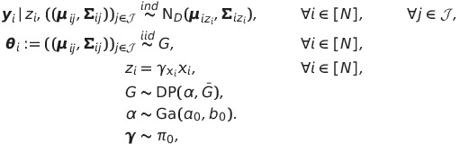

# MANOVABNPTest

where $N$ is the sample size, $J$ is the number of treatment groups, $\boldsymbol{y}_i \in  \mathbb{R}^D$ is the response for the $i$th observation, $x_i \in \mathcal{J} := \{0, \ldots, J\}$ is the associated group label ($x_i = 0$ in the control group), $\text{Ga}(a_0, b_0)$ denotes the Gamma distribution with mean $a_0 / b_0$, $\pi_0:\{0, 1\}^J \to (0, 1)$ is the probability mass function described in section 2.1, and DP$(\alpha, \bar{G})$ denotes a Dirichlet Process (Ferguson, 1973) with concentration parameter $\alpha$ and base probability measure $\bar{G}$, in this case, $\bar{G} := \prod_{j \in \mathcal{J}} L_0$, where $L_0$ denotes the probability measure associated with a $\text{NIW}_D(\boldsymbol{u}_0, r_0, \nu_0, \boldsymbol{S}_0)$ distribution.